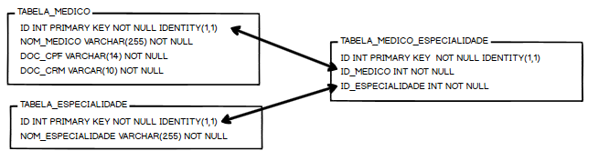

[](https://travis-ci.org/condessalovelace/mavenquickstart) 


<p align="center">MER</p>




# SAAS.Api - Estrutura padrão - controllers - projeto principal
## SAAS.Infra - Comunicação com o Banco de Dados - biblioteca de classes
## SAAS.Service - Normaliza os dados da Api com as Stored Procedure - biblioteca de classes
## SAAS.Model -  Modelos, Classes - biblioteca de classes

```shell
Rodrigo Luiz Madeira Furlaneti - 11 995882409 WhatsApp
```
